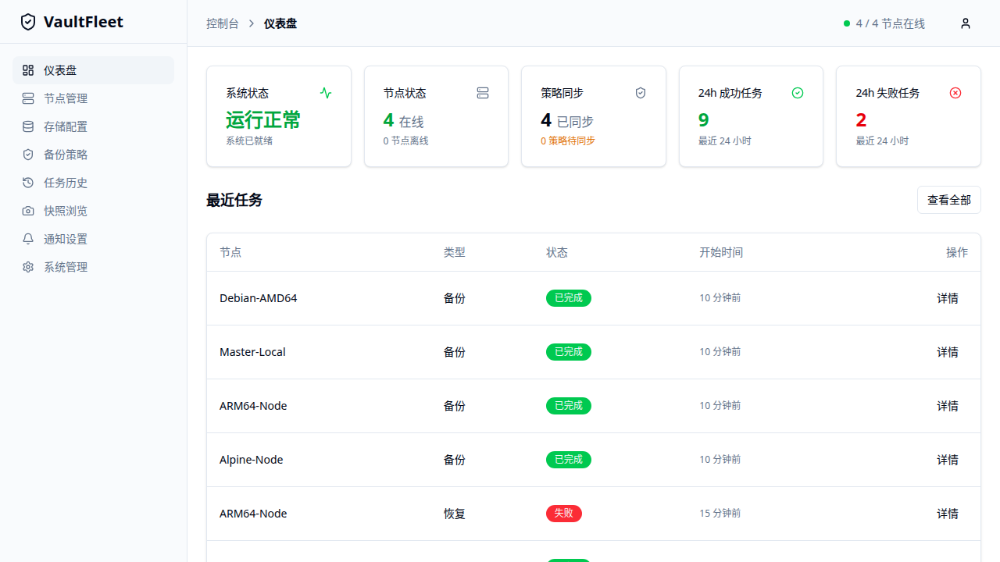

# VaultFleet

<!-- markdownlint-disable MD013 -->

> 像探针一样部署 Agent，像备份平台一样统一编排多台 Linux 服务器的备份、快照和恢复。

**Language:** 中文 | [English](README.en.md)

VaultFleet 是一个面向多台 VPS / Linux 服务器的集中式备份管理系统。它采用 **Master + Agent** 架构：Master 提供 Web UI、API、策略管理、任务历史、快照和通知；Agent 安装在每台服务器上，主动连接 Master，接收备份策略，并使用 `restic` + `rclone` 将备份数据直接写入对象存储、WebDAV、SFTP、网盘或其他 rclone 后端。

备份数据不经过 Master。Master 负责控制面和元数据，Agent 负责本机执行和上传。



## 特性

- **出站连接的 Agent**：节点不需要开放入站端口。
- **集中备份策略**：统一管理备份目录、排除规则、Cron 调度、保留策略、任务超时和存储配置。
- **节点标签与批量策略下发**：用标签组织多节点环境，并将已有策略克隆下发到选定节点或标签匹配节点，详见 [节点标签与批量策略下发](docs/bulk-operations.md)。
- **Web 控制台**：提供仪表盘、节点、存储、策略、任务、快照、通知和系统管理页面。
- **一次性注册令牌**：安装时使用 `enrollment token`，注册后换发长期 `agent_token`。
- **多用户与 API Token**：支持管理员、运维、只读角色和 scoped API Token，并记录敏感操作审计日志。
- **restic 加密仓库**：每台 Agent 使用独立 restic 仓库密码；Master 侧敏感配置使用 `/data/master.key` 加密保存。
- **直接写入存储端**：Agent 通过 rclone 写入 S3 / R2 / MinIO、WebDAV、SFTP、本地路径或其他后端。
- **Docker 工作负载友好**：支持备份容器挂载数据、`docker-compose.yml`、`.env` 等编排文件，并可配置备份前后钩子执行导出或停启服务命令。
- **任务进度、实时日志与取消**：运行中的备份会上报阶段、文件数、字节数和传输速度，并可在任务历史中查看实时日志；长任务支持取消和策略级超时。
- **快照浏览、预检与选择性恢复**：支持刷新快照、浏览快照内容、跨节点恢复、恢复整份快照或选择部分路径恢复，并在 Web UI 中先执行恢复预检。
- **备份可恢复性验证**：可定期对最新 restic 快照执行 check、ls、抽样检查和可选小文件临时恢复测试，详见 [备份可恢复性验证](docs/recoverability-verification.md)。实时日志说明见 [实时备份日志](docs/live-backup-logs.md)。
- **诊断与通知**：支持 Telegram、Webhook、健康检查、系统诊断和 Agent 日志收集。
- **Agent 版本感知与自更新**：Master 可识别 Agent 版本，Agent 可通过 GitHub Release 下载新版二进制并重启。

## 环境要求

| 组件 | 要求 |
| --- | --- |
| Master | Docker / Docker Compose，或能构建 Go 二进制的 Linux 环境 |
| Agent | Linux `amd64` 或 `arm64`，安装脚本需要 root 权限 |
| Agent 服务管理 | systemd、OpenRC，或安装脚本的 `nohup` fallback |
| 源码开发 | Go 版本以 `go.mod` 为准；Web UI 使用 npm 脚本构建和测试 |
| 存储端 | 任意可由 rclone 访问的后端，例如 S3、R2、MinIO、WebDAV、SFTP、本地路径 |

## 快速开始

### 1. 启动 Master

使用 Docker Compose：

```bash
docker compose up -d
```

默认会拉取我的 Docker Hub 镜像：

```text
malabary/vaultfleet:latest
```

服务监听 `http://localhost:8080`，数据保存在当前目录的 `./data`：

```text
data/
├── vaultfleet.db
├── master.key
└── rollback/
```

也可以使用 Docker 直接启动：

```bash
docker run -d \
  --name vaultfleet \
  -p 8080:8080 \
  -v "$(pwd)/data:/data" \
  --restart unless-stopped \
  malabary/vaultfleet:latest
```

首次访问 Web UI 时，需要初始化管理员账号。

> 生产环境建议使用固定版本 tag，并通过反向代理启用 HTTPS / WSS。`http://` 示例只适合本地或受信任内网测试。

如果你没有使用仓库内的 `docker-compose.yml`，可以创建如下 compose 文件：

```yaml
services:
  vaultfleet:
    image: malabary/vaultfleet:latest
    ports:
      - "8080:8080"
    volumes:
      - ./data:/data
    restart: unless-stopped
```

### 2. 添加节点并安装 Agent

在 Web UI 的 **节点管理** 中创建节点后，Master 会生成一次性注册令牌和安装命令。Web UI 支持三种脚本来源：

- GitHub raw：直接从仓库下载安装脚本。
- GitHub + 代理：通过代理下载脚本和 Release 资产。
- Master 服务器：从当前 Master 的 `/install.sh` 下载脚本。

Master-hosted 示例：

```bash
curl -fsSL https://MASTER_HOST/install.sh | bash -s -- \
  --server https://MASTER_HOST \
  --token ek_xxxxxxxxxxxxxxxxxxxxxxxx
```

GitHub 代理示例：

```bash
curl -fsSL https://MASTER_HOST/install.sh | bash -s -- \
  --server https://MASTER_HOST \
  --token ek_xxxxxxxxxxxxxxxxxxxxxxxx \
  --github-proxy https://gh-proxy.example.com
```

安装脚本会：

1. 检测 Linux 架构，目前支持 `amd64` 和 `arm64`。
2. 下载 `vaultfleet-agent` 到 `/usr/local/bin/`。
3. 安装或准备 `restic` 和 `rclone`。
4. 创建 `/etc/vaultfleet/` 配置目录。
5. 使用一次性 token 向 Master 注册。
6. 创建并启动 systemd / OpenRC 服务；没有受支持的 init system 时使用 `nohup` 启动。

`--agent-url` 是高级覆盖参数，用于指定完整的 Agent 二进制下载地址，主要用于测试未发布版本、内网镜像、自建 CDN 或临时下载源。

### 3. 卸载 Agent

```bash
curl -fsSL https://raw.githubusercontent.com/momo-z/VaultFleet/main/build/uninstall.sh | bash
```

该脚本会停止服务，并删除 `vaultfleet-agent`、`restic`、`rclone` 和 Agent 配置目录。

## 典型使用流程

1. 在 **存储配置** 中添加 S3 / R2 / MinIO、WebDAV、SFTP、本地路径或其他 rclone 后端，并执行连接测试。
2. 在 **节点管理** 中创建节点，复制安装命令到目标服务器执行，等待 Agent 注册上线。
3. 可选：在 **节点管理** 中给节点添加环境、区域或业务标签，例如 `prod`、`web`、`openstack:az1`，便于后续筛选和批量下发。
4. 在 **备份策略** 中选择节点和存储，设置仓库子路径、备份来源、排除规则、Cron 调度、保留策略和任务超时。备份来源可以是宿主机目录，也可以是在支持 Docker 的 Agent 上发现并选择的 Docker 容器。
5. 多节点场景下，可在已有策略的操作菜单中选择 **批量下发**，把策略克隆到选定节点或标签匹配节点。
6. 如使用 WebDAV、AList 代理或限流存储，在策略的 **高级传输参数** 中调整 rclone 并发、请求频率、重试和超时。
7. 如果业务运行在 Docker 中，优先备份挂载目录、bind mount 路径、`docker-compose.yml` 和 `.env`，并按需配置备份前后钩子执行数据库导出或短暂停服务。
8. 在 **任务历史** 中查看手动备份、定时备份、恢复任务和运行中备份进度；必要时取消仍在运行的任务。
9. 在 **快照浏览** 中选择源节点和快照，点击恢复后选择目标节点、恢复模式、目标目录或 Docker 来源，先执行恢复预检，再确认提交恢复任务。
10. 需要迁移到新节点时，确保新节点 Agent 在线且能访问相同存储；在恢复抽屉中直接选择新节点作为目标节点，不需要为了看到旧快照而先创建同仓库策略。

## Docker 工作负载备份说明

适用范围：

- 容器挂载的数据目录，例如 `/srv/app/data`、`/var/lib/postgresql/data`
- Compose 或其他编排文件，例如 `docker-compose.yml`、`.env`
- 由备份前钩子导出的数据库转储或应用一致性文件

不在范围内：

- `docker commit`、`docker save`、镜像层备份
- 自动发现并重建容器、网络、端口映射或 Compose stack

推荐做法：

```bash
# 备份目录
/srv/app/data
/srv/app/docker-compose.yml
/srv/app/.env

# 备份前钩子示例
docker exec db pg_dump -U app app >/srv/app/backup/db.sql

# 备份后钩子示例
docker compose start app
```

注意事项：

- 钩子在 Agent 主机上执行，命令失败会导致该次备份任务失败。
- 对数据库容器，优先使用逻辑导出或应用级一致性命令，而不是仅依赖文件层复制。
- 如果使用停服务钩子，请确保备份后钩子能够恢复业务，避免长时间停机。

## Docker 容器备份

Docker 备份在 **备份策略** 中配置，不在存储配置中配置。存储配置里的 container / bucket 表示对象存储容器或存储桶，不是 Docker 容器。

Agent 能访问本机 Docker Engine API 时，会在策略表单中上报 Docker 备份能力并列出容器。通常需要让 Agent 进程具备读取 `/var/run/docker.sock` 的权限；如果 Agent 运行在容器中，需要显式挂载 Docker socket。Docker socket 权限等同于较高的宿主机控制权限，请只在可信 Agent 主机上启用。

选择 Docker 容器后，Agent 会在备份执行前重新检查容器，并将该容器的 bind mount、named/anonymous volume 挂载点和可发现的 Compose 配置文件解析成实际备份路径。VaultFleet 不会默认备份 `/var/lib/docker` 整体、overlay/image layer、网络或镜像内容。

Docker 容器运行中的文件可能缺少应用级一致性。数据库类服务仍建议使用应用自己的 dump、快照、暂停写入或 pre/post hook 流程生成一致数据后再备份对应目录。恢复时，先恢复 Compose 文件和数据目录，再按应用自身流程重建容器。

## 快照恢复与预检

Web UI 的 **快照浏览** 恢复流程会把恢复计划拆成源节点、快照、目标节点、恢复模式、目标目录、选择路径和 Docker 来源。提交恢复前必须先执行预检；预检通过后，最终恢复按钮才会启用。预检只验证当前计划，不会创建 Agent 命令或任务历史。

跨节点文件恢复流程：

1. 在 **快照浏览** 中选择源节点并刷新快照。
2. 选择要恢复的快照，可选择整份快照或浏览后勾选部分路径。
3. 在恢复抽屉中选择目标节点和目标目录。
4. 执行恢复预检，确认目标 Agent 在线、支持所需能力，并且目标路径可创建或可写。
5. 预检通过后勾选确认并提交恢复任务。

Docker 容器恢复流程：

1. 打开带 Docker 备份元数据的快照，选择 **恢复容器**。
2. 选择目标节点和要恢复的 Docker 来源。
3. 执行预检，检查目标 Agent 能访问 Docker Engine、快照中存在 Docker 元数据，并提示明显的容器或 Compose 冲突。
4. 预检通过后提交恢复。VaultFleet 会恢复已备份的 Compose 文件和挂载数据，并按 Agent 支持能力尝试重建容器。

Docker 恢复预检是就绪性检查，不是完整拓扑保证。镜像是否存在或能否从 registry 拉取、外部 Docker 网络、secrets、外部卷、端口占用、运行时权限、数据库迁移和应用级一致性仍需运维人员确认。预检通过后，如果目标环境在提交前发生变化，恢复任务仍可能失败，最终结果以任务历史为准。

预检需要目标 Agent 上报 `restore_preflight` 能力。若页面提示缺少恢复预检能力，请升级目标节点 Agent 并等待它重新连接 Master；旧 Agent 仍可通过兼容的直接恢复 API 接收恢复命令，但 Web UI 的向导式恢复会阻止提交，避免在无法完成运行时检查时误操作。

## 架构

```text
┌──────────────────────────────────────────────┐
│                   Master                      │
│  Web UI / API / SQLite / Policy / Notify      │
└──────────────────────┬───────────────────────┘
                       │ WebSocket 控制面
        ┌──────────────┼──────────────┐
        ▼              ▼              ▼
   ┌─────────┐    ┌─────────┐    ┌─────────┐
   │ Agent A │    │ Agent B │    │ Agent C │
   └────┬────┘    └────┬────┘    └────┬────┘
        │              │              │
        └──────────────┼──────────────┘
                       ▼
        S3 / R2 / MinIO / WebDAV / SFTP / rclone 后端
```

关键设计原则：

- Master 负责控制面，不接收、不中转备份数据。
- Agent 保存本地策略副本，Master 短暂离线不影响已下发的定时备份。
- 每台服务器拥有独立仓库路径和独立 restic 密码。
- Agent 只主动向外连接 Master 和存储端，不要求公网入站访问。

## 安全与信任边界

- 生产环境建议通过反向代理启用 HTTPS / WSS。
- Agent 注册使用一次性 `ek_` token，注册成功后保存长期 `agent_token`。
- Master 使用 bcrypt 保存管理员密码哈希。
- rclone 配置、restic 仓库密码和通知凭据在 Master 数据库中加密保存。
- `/data/master.key` 是 Master 加密主密钥，必须和数据库一起备份并妥善保护。
- Master 会保存并向 Agent 下发执行备份所需的 restic 仓库密码，因此 Master 主机、管理员账号、`vaultfleet.db` 和 `master.key` 都属于信任边界。
- Agent 本地配置默认位于 `/etc/vaultfleet/agent.yaml`，安装目录权限应限制为 root 可读写。

安全问题请按 [Security Policy](SECURITY.md) 处理，不要在公开 issue 中粘贴漏洞细节或敏感凭据。

## 数据导出与恢复

Web UI 的 **系统管理** 页面提供 Master 数据导出和导入。导出的 zip 包含 Master 配置、元数据、密钥和任务记录，不包含远端 restic 仓库中的实际备份数据。

导入要求：

- zip 大小不超过 100 MB。
- zip 内必须包含 `vaultfleet.db` 和 `master.key`。
- 导入确认后，Master 会将文件保存为 `/data/backup.zip` 并退出；容器或进程管理器重启 Master 后会自动恢复。
- 恢复前的数据会保存到 `/data/rollback/`。

## 运维常用命令

```bash
# 拉取最新 Master 镜像并重启
docker compose pull
docker compose up -d

# 查看 Master 日志
docker compose logs --tail=200 -f vaultfleet

# 重启或停止 Master
docker compose restart vaultfleet
docker compose down
```

Agent 常用运维：

```bash
# systemd
systemctl status vaultfleet-agent
journalctl -u vaultfleet-agent --since "24 hours ago" --no-pager
systemctl restart vaultfleet-agent

# OpenRC
rc-service vaultfleet-agent status
rc-service vaultfleet-agent restart

# 无 systemd / OpenRC 时的 fallback 日志
tail -n 300 /var/log/vaultfleet-agent.log
```

## 开发

```bash
# 运行 Go 测试
make test

# 构建二进制
make build-master
make build-agent
make build-all

# 构建 Master Docker 镜像
make docker-build

# 推送到 Docker Hub: malabary/vaultfleet
make docker-push
```

前端开发：

```bash
cd web
npm install
npm run build
npm run test
```

## 文档

- [English README](README.en.md)
- [通信协议](docs/protocol.md)
- [多用户、RBAC 与 API Token](docs/identity-access-control.md)
- [发布流程](docs/release.md)
- [问题反馈和日志收集指南](docs/support.md)
- [贡献指南](CONTRIBUTING.md)
- [安全策略](SECURITY.md)

## 反馈问题

遇到 bug 或需要排障支持时，请先阅读 [问题反馈和日志收集指南](docs/support.md)。

- [选择 Issue 类型](https://github.com/momo-z/VaultFleet/issues/new/choose)
- [Bug report](https://github.com/momo-z/VaultFleet/issues/new?template=bug_report.yml)
- [Support request](https://github.com/momo-z/VaultFleet/issues/new?template=support_request.yml)

发布日志前请脱敏 token、密码、cookie、rclone 凭据、存储密钥、通知凭据和私有 endpoint。

## 许可证

VaultFleet 使用 [MIT License](LICENSE)。

## 参考

- [Komari Monitor](https://github.com/komari-monitor/komari)：Agent 注册、WebSocket 通信、任务下发等探针式部署体验。
- [Nezha](https://github.com/nezhahq/nezha)：Dashboard + Agent 的监控面板项目形态。
- [restic](https://restic.net/)：加密备份引擎。
- [rclone](https://rclone.org/)：多存储后端适配。

<!-- markdownlint-enable MD013 -->
